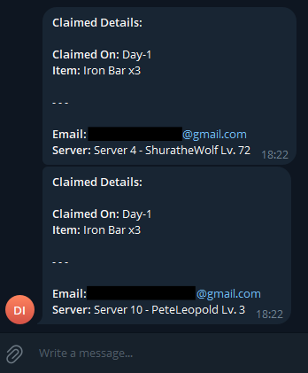

# 🌟 NHIncomeAutoScript 🌟

Automatically claim your daily **Ninja Income** reward on the
[Ninja Heroes New Era](https://kageherostudio.com/event/?event=daily) event site.
A Selenium bot logs in, claims the day's item, and (optionally) notifies you on Telegram.

---

## 📋 Features

- 🛠 **Automated daily claim** — logs in and claims the Ninja Income reward
- 🤖 **Telegram notifications** — optional claim/error reports via a bot
- 👥 **Multi-account** — claim for several accounts in one run
- 🔒 **Credentials via environment variables** — nothing hardcoded in source
- ⏰ **Schedulable** — run via cron or GitHub Actions

---

## ⚙️ How it works

The script drives headless Chrome to the daily event page, logs in with your
account, and clicks the current claimable reward (skipping days already claimed
or locked). `telebot.py` additionally posts the result to a Telegram chat.

Two entry points:
- **`main.py`** — runs the claim and logs results to the console.
- **`telebot.py`** — runs the claim and sends a Telegram notification (recommended for scheduled runs).

---

## 🚀 Getting Started

### Prerequisites
- **Python 3.8+**
- **Google Chrome** installed (Selenium Manager auto-fetches the matching chromedriver)
- Python packages:
  ```bash
  pip install -r requirements.txt
  ```
  (`selenium`, `requests`, `termcolor`)

### Configuration (environment variables)
Credentials are read from env vars — never hardcoded. For each account use a
numbered suffix (`1`, `2`, …):

| Variable | Description |
|---|---|
| `EMAIL1` | Account email |
| `PASSWORD1` | Account password |
| `SERVER_NAME1` | Exact server name, e.g. `Server 35 - SolomonKent [Lv. 3]` |
| `TELEGRAM_BOT_TOKEN` | (telebot.py) Bot token from [@BotFather](https://t.me/BotFather) |
| `TELEGRAM_CHAT_ID` | (telebot.py) Your chat ID |

A convenient local pattern is a `.env` file (already git-ignored):
```bash
export EMAIL1="you@example.com"
export PASSWORD1='your_password'
export SERVER_NAME1="Server 35 - SolomonKent [Lv. 3]"
export TELEGRAM_BOT_TOKEN="123456:ABC..."
export TELEGRAM_CHAT_ID="987654321"
```
Then: `set -a; source .env; set +a`

> ⚠️ Never commit `.env` or real credentials. They are git-ignored by default.

### Run
```bash
python main.py      # console output
python telebot.py   # console output + Telegram notification
```

---

## 🖼️ Screenshots
<p align="center">
  
  <br>
  <i>Example Telegram notification after a successful claim.</i>
</p>

---

## ⏰ Scheduling

### Option A — Local cron (recommended)
A daily cron on a machine with a **residential IP**:
```bash
30 7 * * * /path/to/run.sh   # wrapper that sources .env and runs telebot.py
```

### Option B — GitHub Actions
A workflow (`.github/workflows/main.yml`) is included. Add your env values as
**repository secrets** (Settings → Secrets and variables → Actions).

> ⚠️ **Heads-up on Cloudflare:** the event site is protected by Cloudflare's
> bot challenge, which tends to **block datacenter IPs** — including GitHub
> Actions runners. Scheduled runs from a cloud/datacenter IP may fail the
> security check. Running from a **residential IP** (e.g. a home/office machine)
> reliably passes. Choose your runner accordingly.

---

## 🛠 Troubleshooting

- **Login times out / "Just a moment…" page** → Cloudflare challenged the IP. Run from a residential connection (see above).
- **`element not interactable`** → ensure you're on the latest version (the login wait was fixed).
- **`chromedriver` not found** → upgrade Selenium (`pip install -U selenium`); Selenium Manager handles the driver automatically.
- **No Telegram message** → confirm `TELEGRAM_BOT_TOKEN` / `TELEGRAM_CHAT_ID` are set, and that you've sent your bot a message first.

---

## 🛡️ License

This project is licensed under the **MIT License**. You are free to use, modify, and distribute this project. See the [LICENSE](LICENSE) file for more details.

---

## 🤝 Contributing

We welcome contributions to enhance this project! Here's how you can contribute:
1. **Fork the Repository**: Create a copy of the repository on your account.
2. **Create a New Branch**: Add your features or fixes:
   ```bash
   git checkout -b feature/NewFeature
   ```
3. **Submit a Pull Request**: Once your changes are complete, submit a PR with a detailed description.

---

## 📧 Contact

For questions, suggestions, or feedback, feel free to contact us:
- **GitHub**: [@shuura6661](https://github.com/shuura6661)
- **Email**: briannoname1999@gmail.com

---

<p align="center">Made with ❤️ for Ninja Heroes fans!</p>
